# OFBiz / Moqui Learning Notes

---

## Table of Contents

1. [Client-side vs Server-side Validation](#1-client-side-vs-server-side-validation)
2. [Seed Data vs Demo Data](#2-seed-data-vs-demo-data)
3. [Logging in OFBiz](#3-logging-in-ofbiz)
4. [debug.properties](#4-debugproperties)
5. [Service Pattern](#5-service-pattern-in-ofbiz)
6. [Event](#6-event)
7. [Component Loading](#7-component-loading)
8. [Component Structure](#8-component-structure)
9. [Config Folder](#9-config-folder)
10. [Data Folder](#10-data-folder)
11. [Entity Definition](#11-entity-definition)
12. [Field Types](#12-field-types)
13. [Services Definition](#13-services-definition)
14. [Source Folder](#14-source-folder)
15. [Web Layer](#15-web-layer)
16. [Request Flow](#16-request-flow)
17. [Login Flow](#17-login-flow)
18. [Screen Widget](#18-screen-widget)
19. [Context Map & Parameters Map](#20-context-map--parameters-map)
20. [Main Decorator](#23-main-decorator)
21. [Build Process](#27-build-process)
22. [XML to SQL Flow](#29-xml-to-sql-flow)
23. [Recommended Study Order](#recommended-study-order)

---

## 1. Client-side vs Server-side Validation

### Client-side Validation

Validation that runs **inside the browser** before any request is sent to the server. It is written in JavaScript and catches simple mistakes early, giving the user instant feedback.

**Examples:**
- Required field check (is the name field empty?)
- Email format check (does it have an `@` sign?)
- Password length check (at least 8 characters?)

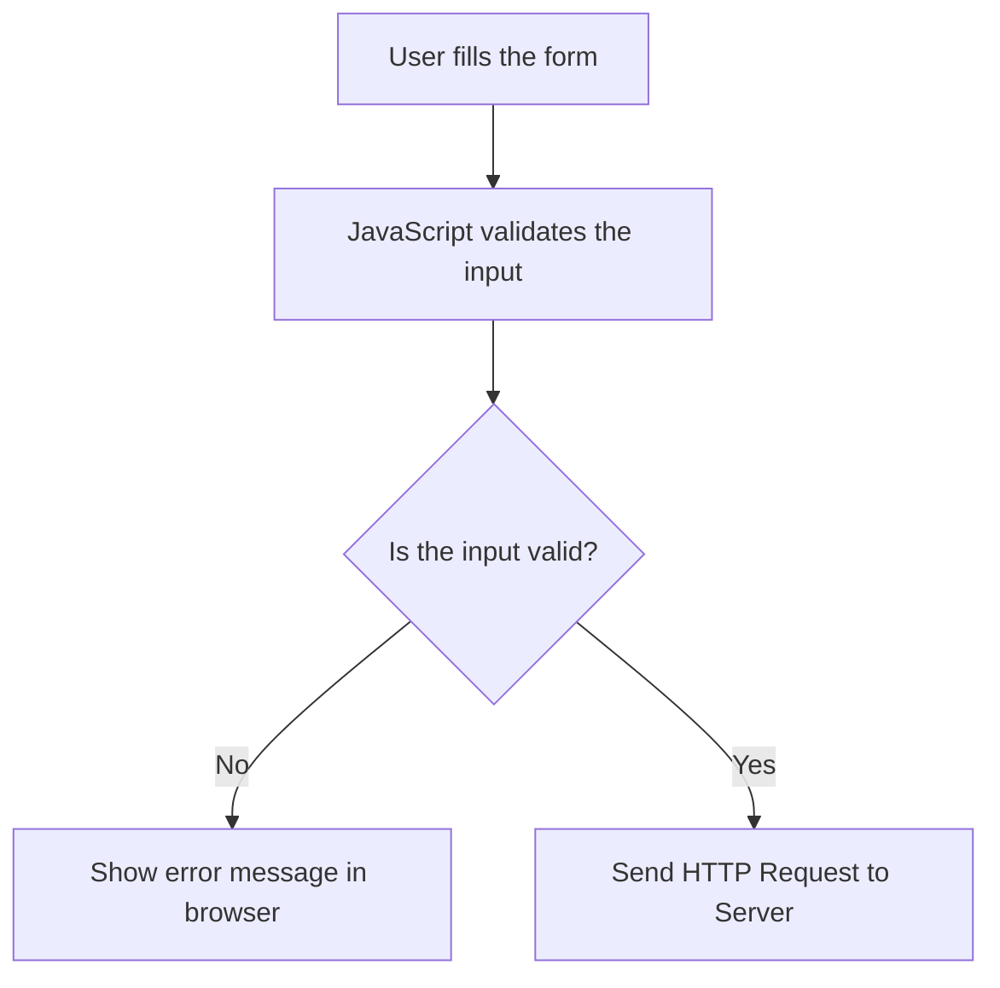

**Advantages:**
- Very fast — no network trip needed
- Reduces unnecessary server load
- Better user experience

> ⚠️ **Important:** Client-side validation can be **bypassed** by a hacker using browser developer tools. So it is never enough on its own.

---

### Server-side Validation

Validation that runs on the **server** after the HTTP request arrives. This is the real and mandatory layer of protection.

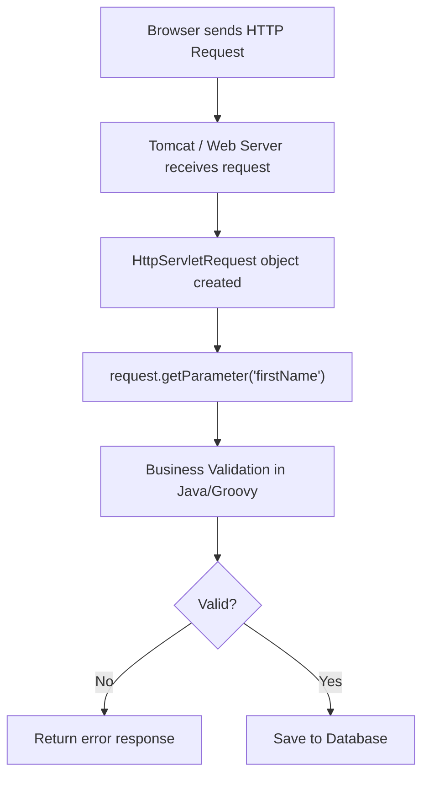

**Example:**
```java
String firstName = request.getParameter("firstName");
if (firstName == null || firstName.isEmpty()) {
    return "error"; // reject the request
}
```

**What server-side validation checks:**
- Required fields that must not be empty
- Duplicate records (e.g., email already exists)
- Business rules (e.g., order quantity must be > 0)
- Database constraints (e.g., foreign key checks)

---

## 2. Seed Data vs Demo Data

### Seed Data

Seed Data is the **minimum required data** for the application to start and run correctly. Without it, OFBiz cannot function.

**Examples of Seed Data:**
- Status IDs (e.g., `ORDER_CREATED`, `ITEM_APPROVED`)
- Enumeration values (e.g., order types, payment types)
- Security groups and permissions
- User login types
- Entity type definitions
- Country and state lists

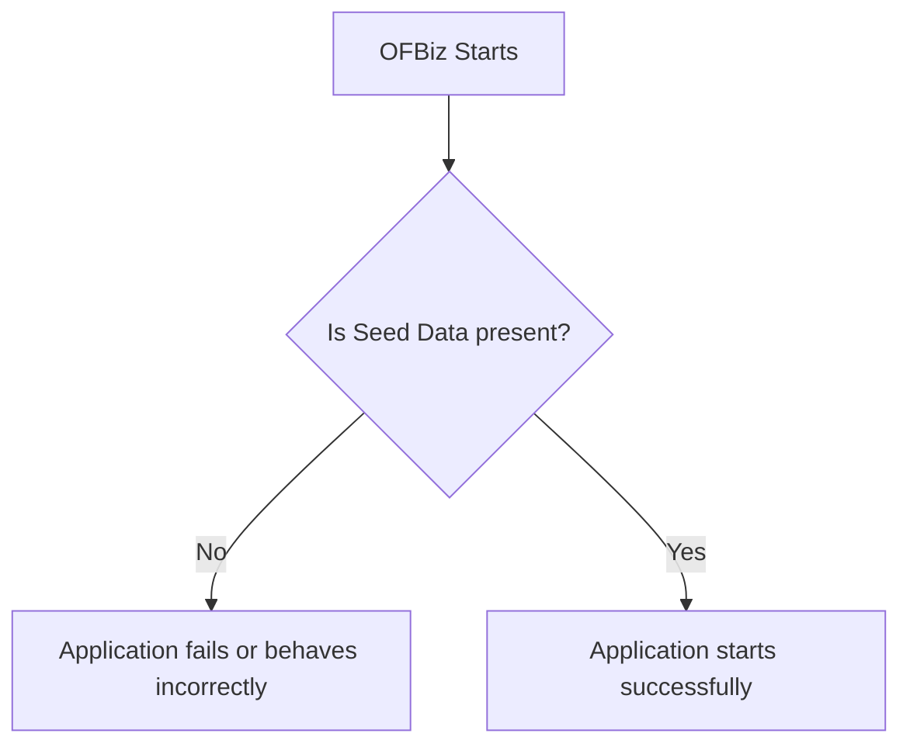

**Where is it stored?**
Inside `data/` folders of each component, in XML files tagged as `seed` or `seed-initial`.

---

### Demo Data

Demo Data is **optional** data used only for testing, learning, or demonstrations. Removing it does not break the application.

**Examples of Demo Data:**
- Demo customers (e.g., `DemoCustomer`)
- Demo orders
- Demo products

> ✅ In production environments, demo data is **not loaded**.

---

## 3. Logging in OFBiz

OFBiz uses **Apache Log4j2** for logging instead of `System.out.println()`.

### Why not use `System.out.println()`?

| Feature | `System.out.println()` | `Debug` class (Log4j2) |
|---|---|---|
| Can be turned ON/OFF | ❌ No | ✅ Yes |
| Writes to log files | ❌ No | ✅ Yes |
| Has severity levels | ❌ No | ✅ Yes |
| Works in production | ❌ Bad practice | ✅ Yes |

### Log Levels (from least to most severe)

```
TRACE  →  Very detailed steps (rarely used)
DEBUG  →  Developer debug info
INFO   →  General information
WARN   →  Something suspicious happened
ERROR  →  Something went wrong
FATAL  →  Critical failure, system may crash
```

### Usage in Java Code

```java
// At top of every OFBiz class:
private static final String MODULE = OrderServices.class.getName();

// In your method:
Debug.logInfo("Order created successfully! OrderId: " + orderId, MODULE);
Debug.logWarning("Product stock is running low!", MODULE);
Debug.logError("Cannot find Order with ID: " + orderId, MODULE);
Debug.logError(e, "Exception occurred while processing order", MODULE);
Debug.logFatal("Database connection lost!", MODULE);
```

> The `MODULE` constant tells Log4j **which class** wrote the message. This makes it easy to find problems in the logs.

### Log Output Format

```
2026-07-14 10:30:15 | main-thread          | OrderServices            |I| Order created: ORD1001
```

| Part | Meaning |
|---|---|
| `2026-07-14 10:30:15` | Date and time |
| `main-thread` | Which thread ran the code |
| `OrderServices` | Which class logged the message |
| `I` | Level: I=Info, W=Warn, E=Error, F=Fatal |
| `Order created: ORD1001` | The actual message |

### Log Files

| File | What it contains |
|---|---|
| `runtime/logs/ofbiz.log` | ALL messages (info, warn, error...) |
| `runtime/logs/error.log` | ONLY error and fatal messages |

> Log files automatically **rotate** when they reach 10 MB. Old files are renamed (`ofbiz.log.1`, `ofbiz.log.2`...).

---

## 4. debug.properties

This file is located at `framework/base/config/debug.properties`. It controls **which log levels are active**.

```properties
print.verbose=false      # Too much detail — keep OFF in most cases
print.timing=true        # Shows how long operations take
print.info=true          # General info messages
print.important=true     # Important notices
print.warning=true       # Warnings
print.error=true         # Errors
print.fatal=true         # Fatal crashes
```

> **Tip:** In a production server, set `print.verbose=false` and `print.timing=false` to reduce log noise and improve performance.

---

## 5. Service Pattern in OFBiz

Every service in OFBiz follows the **same pattern**: takes a `Map` as input, returns a `Map` as output.

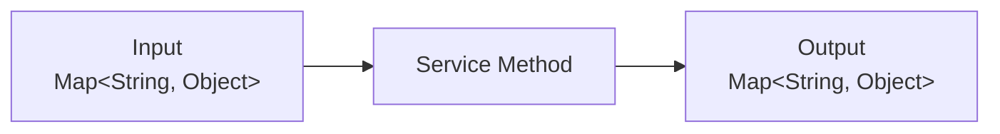

### Service Method Signature

```java
public static Map<String, Object> createCustomer(
        DispatchContext dctx,
        Map<String, Object> context) {

    // Get delegator and dispatcher
    Delegator delegator = dctx.getDelegator();
    LocalDispatcher dispatcher = dctx.getDispatcher();

    // Read inputs from context map
    String firstName = (String) context.get("firstName");
    String lastName  = (String) context.get("lastName");

    // Do business logic here...

    // Return success
    return ServiceUtil.returnSuccess();
    // Or return error:
    // return ServiceUtil.returnError("Something went wrong!");
}
```

### What a Service Usually Contains

- **Input reading** — `context.get("fieldName")`
- **Validation** — checking if inputs are correct
- **Business logic** — calculations, decisions
- **Database operations** — using `delegator`
- **Calling other services** — using `dispatcher.runSync()`
- **Error handling** — try/catch blocks
- **Logging** — `Debug.logInfo(...)`, `Debug.logError(...)`
- **Return result** — `ServiceUtil.returnSuccess()` or `ServiceUtil.returnError()`

---

## 6. Event

An Event is a Java method that acts as the **bridge between the UI (browser) and a Service**.

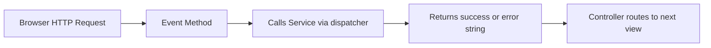

**Key characteristics:**
- Has access to `HttpServletRequest` and `HttpServletResponse`
- Can read session data (who is logged in)
- Performs **input validation** before calling a service
- Returns a string like `"success"` or `"error"` — the controller uses this to decide which page to show next

```java
public static String createCustomerEvent(
        HttpServletRequest request,
        HttpServletResponse response) {

    String firstName = request.getParameter("firstName");

    // Validate
    if (firstName == null || firstName.isEmpty()) {
        request.setAttribute("_ERROR_MESSAGE_", "First name is required");
        return "error";
    }

    // Call service
    // ...
    return "success";
}
```

> **Remember:** Events know about HTTP and sessions. Services do NOT. This separation keeps business logic clean and reusable.

---

## 7. Component Loading

OFBiz loads components in a specific order every time it starts.

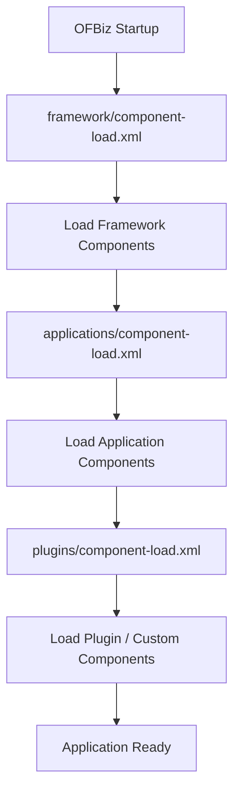

Each component is defined by an `ofbiz-component.xml` file that tells OFBiz:
- Where entity definitions are
- Where service definitions are
- Where data files are
- Where the webapp is
- What URL path (mount point) to use

---

## 8. Component Structure

```
plugins/myPlugin/
│
├── config/                  ← UI Labels and .properties files
├── data/                    ← Seed and Demo XML data files
├── dtd/                     ← XML schema definitions
├── entitydef/               ← Entity (table) definitions
│   └── entitymodel.xml
├── servicedef/              ← Service definitions
│   └── services.xml
├── src/                     ← Java and Groovy source code
│   └── main/groovy/...
├── widget/                  ← Screen and Form widgets (XML UI)
│   ├── screens/
│   └── forms/
├── webapp/                  ← Web application files
│   ├── WEB-INF/
│   │   ├── web.xml
│   │   └── controller.xml
│   ├── *.ftl               ← FreeMarker HTML templates
│   ├── *.js
│   └── *.css
└── ofbiz-component.xml      ← Component registration file
```

---

## 9. Config Folder

### `ExampleUiLabels.xml` — Multilingual Labels

This file stores all text labels used in the UI, in multiple languages.

**Why is this important?**
- OFBiz supports **Internationalization (i18n)** — the app can display in any language
- **Localization (l10n)** — adapting content for a specific region

```xml
<property key="OrderCreated">
    <value xml:lang="en">Order Created</value>
    <value xml:lang="es">Pedido Creado</value>
    <value xml:lang="fr">Commande Créée</value>
</property>
```

In a FTL template, you use it as:
```
${uiLabelMap.OrderCreated}
```
OFBiz automatically shows the label in the user's language.

---

### `.properties` Files

Store simple `key = value` configuration pairs.

```properties
application.name=My OFBiz App
max.order.limit=1000
default.currency=USD
```

The general properties file is at:
```
framework/common/config/general.properties
```

Read in Java using:
```java
String value = UtilProperties.getPropertyValue("general", "application.name");
```

---

## 10. Data Folder

The `data/` folder inside each component contains XML files that are loaded into the database.

Which files get loaded is controlled by `ofbiz-component.xml`:
```xml
<entity-resource type="data" reader-name="seed"
    location="data/MySeedData.xml"/>
<entity-resource type="data" reader-name="demo"
    location="data/MyDemoData.xml"/>
```

| `reader-name` | Loaded by command |
|---|---|
| `seed` | `./gradlew loadAll` |
| `seed-initial` | `./gradlew loadAll` (only first time) |
| `demo` | `./gradlew loadAll` |
| `ext` | `./gradlew loadAll` |

---

## 11. Entity Definition

Entity definitions are stored in `entitydef/entitymodel.xml`. They define the **database tables** in OFBiz's own XML language — you never write raw SQL for table creation.

```xml
<entity entity-name="Customer"
        package-name="com.example.myapp"
        title="Customer Entity">

    <field name="customerId"    type="id"/>
    <field name="firstName"     type="name"/>
    <field name="lastName"      type="name"/>
    <field name="emailAddress"  type="email"/>
    <field name="createdDate"   type="date-time"/>

    <prim-key field="customerId"/>

    <relation type="one" rel-entity-name="Party">
        <key-map field-name="customerId" rel-field-name="partyId"/>
    </relation>
</entity>
```

OFBiz reads this XML and automatically:
1. Creates the table in the database if it doesn't exist
2. Generates the SQL `CREATE TABLE` statement
3. Manages all CRUD operations through the Delegator

---

## 12. Field Types

When you define a field in an entity, you use a **type name** (not a raw database type). OFBiz maps these type names to actual database column types.

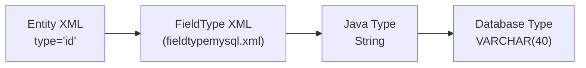

**Common field types:**

| Type Name | Java Type | MySQL Type |
|---|---|---|
| `id` | String | VARCHAR(40) |
| `id-long` | String | VARCHAR(100) |
| `name` | String | VARCHAR(100) |
| `description` | String | VARCHAR(255) |
| `very-long` | String | LONGTEXT |
| `date-time` | Timestamp | DATETIME |
| `date` | Date | DATE |
| `currency-amount` | BigDecimal | DECIMAL(18,2) |
| `numeric` | Long | BIGINT |
| `indicator` | String | CHAR(1) — stores 'Y' or 'N' |

Field type mappings are stored in:
```
framework/entity/fieldtype/fieldtypemysql.xml
framework/entity/fieldtype/fieldtypederby.xml
```

---

## 13. Services Definition

Services are **declared** in `servicedef/services.xml` before being **implemented** in Java or Groovy.

```xml
<service name="createCustomer" engine="java"
         location="com.example.myapp.CustomerServices"
         invoke="createCustomer"
         auth="true"
         transaction-timeout="30">

    <description>Creates a new customer record</description>

    <auto-attributes include="nonpk" mode="IN" optional="true"/>

    <attribute name="customerId"  mode="OUT" type="String" optional="false"/>

</service>
```

**Key attributes explained:**

| Attribute | Meaning |
|---|---|
| `engine="java"` | The service is written in Java (can also be `groovy`, `script`) |
| `auth="true"` | User must be logged in to call this service |
| `transaction-timeout="30"` | DB transaction times out after 30 seconds |
| `auto-attributes include="nonpk"` | Automatically add all non-primary-key entity fields as inputs |
| `mode="IN"` | Input parameter |
| `mode="OUT"` | Output parameter |
| `optional="true"` | This field is not required |

---

## 14. Source Folder

The `src/` folder contains the actual business logic in **Java** or **Groovy**.

```
src/
└── main/
    ├── java/
    │   └── com/example/myapp/
    │       └── CustomerServices.java
    └── groovy/
        └── com/example/myapp/
            └── CustomerLogic.groovy
```

**When to use Java vs Groovy:**
- **Java** — for complex services, performance-critical code, when type safety matters
- **Groovy** — for scripts in screen widgets, quick logic, closures, and simpler services

---

## 15. Web Layer

```
webapp/
│
├── WEB-INF/
│   ├── web.xml          ← Servlet configuration (entry point)
│   └── controller.xml   ← URL routing (request-maps, view-maps)
│
├── *.ftl                ← FreeMarker HTML templates
├── *.js                 ← JavaScript files
└── *.css                ← CSS stylesheets
```

**`web.xml`** — tells Tomcat:
- Which Servlet handles all requests (it's `ControlServlet`)
- What the app's base URL path is (e.g., `/example`)

**`controller.xml`** — tells OFBiz:
- Which URL maps to which Event
- Which Event result maps to which View
- Which View maps to which Screen

---

## 16. Request Flow

This is how a request travels from browser to response in OFBiz:

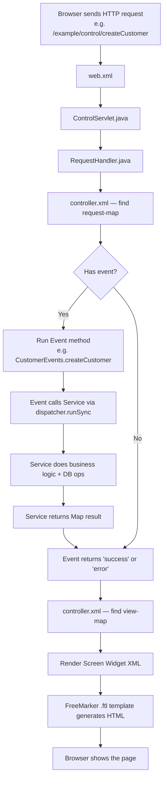

**Key files to study:**
- `framework/webtools/src/.../control/ControlServlet.java`
- `framework/webtools/src/.../control/RequestHandler.java`

---

## 17. Login Flow

When a user logs in to OFBiz, this is what happens:

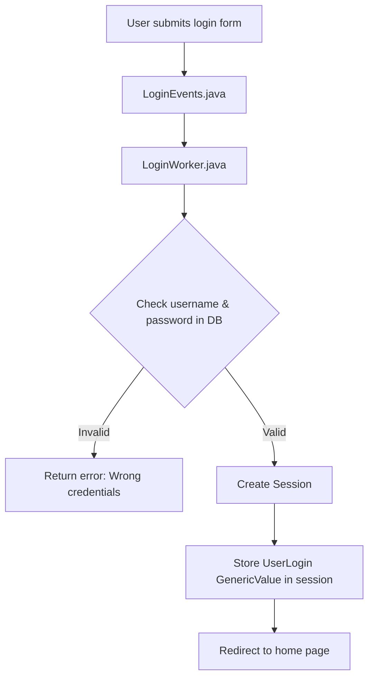

- **`LoginEvents.java`** — handles the HTTP request and calls LoginWorker
- **`LoginWorker.java`** — contains the actual authentication logic
- **Session** — server-side memory that remembers who you are during your visit

---

## 18. Screen Widget

Screen Widgets define **page layouts** using XML. They are OFBiz's own UI templating system.

### Structure of a Screen

```xml
<screen name="CustomerDetail">
    <section>
        <actions>
            <!-- Step 1: Prepare data for the page -->
            <set field="titleProperty" value="Customer Detail"/>
            <entity-one entity-name="Customer" value-field="customer">
                <field-map field-name="customerId" from-field="parameters.customerId"/>
            </entity-one>
        </actions>
        <widgets>
            <!-- Step 2: Render the UI -->
            <decorator-screen name="main-decorator"
                location="component://example/widget/screens/CommonScreens.xml">
                <decorator-section name="body">
                    <include-form name="CustomerDetailForm"
                        location="component://example/widget/forms/CustomerForms.xml"/>
                </decorator-section>
            </decorator-screen>
        </widgets>
    </section>
</screen>
```

### Simple Data Preparation (`<set>`)

Used when you need to assign a simple value:
```xml
<set field="customerName" value="Amogh"/>
<set field="pageTitle" value="Order Management"/>
```

### Complex Data Preparation (Groovy Script)

Used when you need loops, conditions, or API calls:
```xml
<script location="component://example/groovy/PrepareCustomerData.groovy"/>
```

---

## 19. Include Screen

Used to embed one screen inside another:
```xml
<include-screen name="CustomerHeader"
    location="component://example/widget/screens/CustomerScreens.xml"/>
```
This is like including a header/footer component — reusable across multiple pages.

---

## 20. Context Map & Parameters Map

### Context Map

The `context` is an **implicit object** available in all screens and FTL templates. You do NOT need to declare it.

In a Groovy script:
```groovy
context.customerName = "Amogh"    // Set a value
```

In a FTL template:
```
${customerName}    ← Access directly, no need for context.get()
```

### Parameters Map

The `parameters` map contains all HTTP request parameters. OFBiz automatically fills it from `HttpServletRequest`.

In a FTL template:
```
${parameters.customerId}    ← Same as request.getParameter("customerId")
```

In a Groovy/screen action:
```groovy
String customerId = parameters.customerId
```

---

## 21. Context Parameters from `web.xml`

You can define application-level parameters in `web.xml`:
```xml
<context-param>
    <param-name>mainDecoratorLocation</param-name>
    <param-value>component://example/widget/screens/CommonScreens.xml</param-value>
</context-param>
```

Access in screens:
```xml
<decorator-screen name="main-decorator" location="${parameters.mainDecoratorLocation}"/>
```

---

## 22. Main Decorator

The Main Decorator is the **master page template** — it provides the consistent layout that wraps every page.

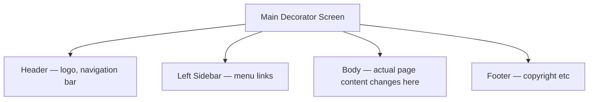

The body content is injected using:
```xml
<decorator-section-include name="body"/>
```

Each page screen defines what goes in the `body` decorator section.

---

## 23. Theme Initialization

OFBiz themes control the look and feel. Initialization order:

```
framework/common/widget/CommonScreens.xml
    └── InitTheme.groovy (runs on every page load)
        └── themes/common-theme/widget/CommonScreens.xml
            └── Applies CSS, JS, layout settings
```

---

## 24. Build Process

### `./gradlew build`
- Compiles all `.java` files into `.class` files
- Packages them into `.jar` files
- Checks for compile errors
- Does NOT start the server

### `./gradlew ofbiz`
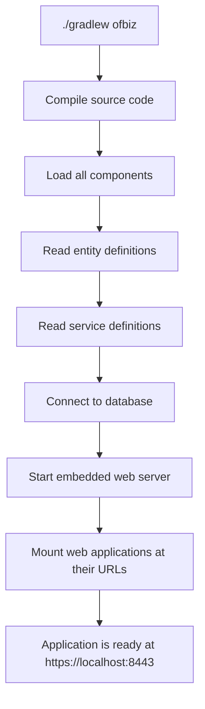

### `./gradlew loadAll`
Loads **all data files** into the database.

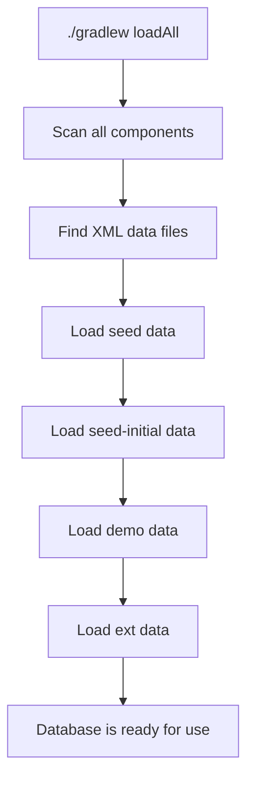

> Run `loadAll` once after setting up a fresh database, or after a full reset.

---

## 25. Database Connectivity

Database connection is configured in `entityengine.xml`:

```xml
<datasource name="localmysql" ...>
    <inline-jdbc
        jdbc-driver="com.mysql.cj.jdbc.Driver"
        jdbc-uri="jdbc:mysql://127.0.0.1/ofbiz"
        jdbc-username="root"
        jdbc-password="12345"
        isolation-level="ReadCommitted"
        pool-minsize="2"
        pool-maxsize="250"/>
</datasource>
```

The JDBC driver JAR is added to the classpath via `dependencies.gradle`.

---

## 26. XML to SQL Flow

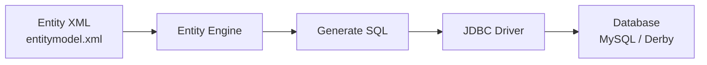

You write XML. OFBiz generates and runs the SQL for you.

---

## 27. Full Navigation Flow Example

```
https://localhost:8443/example/control/main

↓ web.xml → ControlServlet

↓ RequestHandler → controller.xml

↓ request-map name="main"

↓ event (optional)

↓ service (optional)

↓ view-map name="main"

↓ ExampleScreens.xml → screen "main"

↓ CommonScreens.xml → main-decorator

↓ Theme CSS/JS applied

↓ HTML sent to browser
```

---

## Recommended Study Order

Study topics in this order — it follows how a request flows through the system:

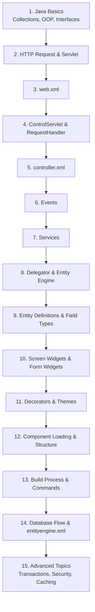

---

## Quick Reference Cheat Sheet

| Concept | One-liner |
|---|---|
| **Client-side Validation** | Runs in browser before request is sent |
| **Server-side Validation** | Runs on server — mandatory and cannot be bypassed |
| **Seed Data** | Minimum data needed for the app to run |
| **Demo Data** | Optional data for testing only |
| **Debug class** | OFBiz logging — replaces `System.out.println()` |
| **debug.properties** | Turns log levels ON/OFF |
| **Service** | Stateless business logic — `Map` in, `Map` out |
| **Event** | HTTP-aware bridge between UI and Service |
| **Delegator** | Manager between your code and the database |
| **GenericValue** | One database row (works like a Map) |
| **ofbiz-component.xml** | Component registration file |
| **entitymodel.xml** | Defines database tables in XML |
| **services.xml** | Declares services (name, engine, params) |
| **controller.xml** | Maps URLs to Events and Views |
| **web.xml** | Servlet configuration and mount point |
| **Screen Widget** | XML-based page layout |
| **Form Widget** | XML-based form or list |
| **Context Map** | Implicit data map available in screens/FTL |
| **Parameters Map** | HTTP request parameters — filled automatically |
| **Main Decorator** | Master page template (header + body + footer) |
| **`./gradlew build`** | Compile source code into JAR files |
| **`./gradlew ofbiz`** | Start the OFBiz web server |
| **`./gradlew loadAll`** | Load all seed/demo data into the database |
| **`runtime/logs/`** | Where `ofbiz.log` and `error.log` are written |
