# OFBiz / Moqui Learning Notes & Architectural Guide

---

# Part 1: Apache OFBiz - Classroom Notes & Architectural Guide (Sections 1 - 20)

## Section 1: Delegator & Database Operations

The **`delegator`** is your primary helper object for reading and writing data in the database.
The `delegator` object is responsible for database operations, record fetching, and full CRUD (Create, Read, Update, Delete) execution in OFBiz.

### Fetching Records
* **`delegator.findOne("<entity-name>", mapObject, useCache)`**:
  * Used when you want to get **a single record** (a single row in the database).
  * You pass the entity name and a Map containing your primary key search conditions.
* **`delegator.find("<entity-name>", condition, ...)`**:
  * Used when you want to get **a list of records**.
  * You pass the entity name and your search conditions using comparison operators (`<`, `>`, `<=`, `>=`, `<>`).

### Modern Entity Query Syntax (`EntityQuery`)
Instead of calling raw delegator methods, OFBiz gives us a clean builder syntax called `EntityQuery`:

```java
// Fetch a single record
GenericValue product = EntityQuery.use(delegator)
    .from("Product")
    .where("productId", productId)
    .queryOne();

// Fetch a list of records
List<GenericValue> productList = EntityQuery.use(delegator)
    .from("Product")
    .where("productTypeId", "FINISHED_GOOD")
    .queryList();
```

---

## Section 2: Configuration, Database Switching & Build Tools

### Switching Databases (`entityengine.xml`)
* `entityengine.xml` is the configuration file where delegators and database connections are defined.
* You use this file when you want to switch OFBiz from the default embedded **Derby** database to relational databases like **MySQL** or **PostgreSQL**.

### Build Tools & File Types
* **`./gradlew build`**: Compiles your Java files into `.class` files and packages them into archives.
* **JAR File (`Java Archive`)**: A compressed `.jar` file containing compiled Java classes and supporting libraries.
* **WAR File (`Web Archive`)**: A compressed `.war` web package deployed on the web server (Apache Tomcat). 
  * Each web app deployed via a WAR file is accessed using its unique **Mount Point URL**.
  * All supporting library `.jar` files are placed on the application's **Classpath**.

---

## Section 3: Classpath vs PATH & System Gradle Commands

### Important Concepts
* **Classpath**: The list of folder locations and `.jar` files loaded into memory when OFBiz runs so Java can find all system classes.
* **PATH (`echo $PATH`)**: The system environment variable pointing to directories on your computer where executable binary commands live.

### Essential Gradle Commands
* **`./gradlew ofbiz`**: Starts the embedded Tomcat web server and mounts all configured web applications.
* **`./gradlew load`**: Initializes database tables, creates indexes, and populates initial setup data (seed and seed-initial data).
* **`./gradlew loadAll`**: Loads all components across framework, core applications, and custom plugins.
* **`./gradlew clean`**: Deletes all compiled `.class` files, build output directories, temporary log files, and embedded Derby database files inside the `runtime/` folder.

---

## Section 4: Logging, Debugging & Cache

### Stack Trace Analysis
When an error occurs, the console or log file displays a **Stack Trace**. Learning to read stack traces helps you immediately locate the exact file name and line number where the issue happened.

### In-Memory Caching
OFBiz stores frequently read database records in **runtime memory cache** so future read requests don't need to hit the database, making the app much faster.

### System Logging (`Log4j2`)
Configured via `log4j2.xml`. It manages system log files:
* `ofbiz.log`: Main system runtime log.
* `error.log`: Logged exceptions and errors.
* `debug.log`: Detailed debugging diagnostics.

### Debug Class vs. `System.out.println`
Never use `System.out.println()` in OFBiz code! Instead, use the `Debug` class (`Debug.java`, configured via `debug.properties`):
* `Debug.logInfo("Informational message", module)`
* `Debug.logWarning("Warning message", module)`
* `Debug.logError(e, "Error message", module)`

---

## Section 5: Directory Architecture

OFBiz organizes its codebase into clear directories:

```
ofbiz/
├── framework/    <-- Core framework engine (Entity Engine, Service Engine, Security, etc.)
├── applications/ <-- Built-in applications (Order, Product, Party, Accounting, Webtools)
├── plugins/      <-- Custom client components (Your custom code goes here!)
└── runtime/      <-- Generated logs (runtime/logs/ofbiz.log), Derby DB files, temp files
```

* **`/framework`**: Contains core system engines. Do not modify files here!
* **`/applications`**: Default business components provided by OFBiz.
* **`/plugins`**: Dedicated folder for client-specific custom plugins. Keeping custom code here prevents framework updates from overwriting your work.
* **`/runtime`**: Holds generated log files, embedded Derby database files, and temporary execution files.

---

## Section 6: Data Readers & Ingestion Rules

Data Readers specify which XML data files get loaded into the database:

1. **`seed`**: Mandatory structural data (such as `WorkEffortType` or `StatusItem`) needed for the system to run.
2. **`seed-initial`**: Baseline data loaded only once during initial setup (such as default admin user `admin` with password `ofbiz`, temporal expressions, and system job data).
3. **`demo`**: Sample data used for testing.
4. **`ext`**: Custom client data additions.

> **Production Rule**: Never run `loadAll` on production servers! Only load specific data readers like `seed` and `seed-initial`.

---

## Section 7: Request Processing & Validation

### Validation Levels
1. **Client-Side Validation**: Performed in the browser form before submitting.
2. **Server-Side Validation**: Performed on the server when Tomcat receives the `HttpServletRequest`. The server reads parameters using `request.getParameter()` and validates the data before passing it to backend services.

---

## Section 8: Events vs. Services Comparison

### What is an Event?
An **Event** handles raw HTTP request and response objects (`HttpServletRequest`, `HttpServletResponse`). It returns a `String` control keyword (like `"success"` or `"error"`) and has direct access to the user's session (`request.getSession()`). Events are used to validate input data before calling services.

### What is a Service?
A **Service** is a session-less block of business logic. It takes an input `Map` and returns an output `Map` (using `ServiceUtil.returnSuccess()` or `ServiceUtil.returnError()`). Services can run synchronously (`runSync`) or asynchronously (`runAsync`) and can be scheduled as background jobs.

### Comparison Table

| Feature | Event | Service |
| :--- | :--- | :--- |
| **Inputs / Outputs** | `HttpServletRequest` & `HttpServletResponse` | Input `Map` in, Output `Map` out |
| **Return Type** | `String` (e.g., `"success"`, `"error"`) | `Map` (Success/Error Map) |
| **Session Access** | Has direct access (`request.getSession()`) | Session-less (No direct session access) |
| **Execution Mode** | Synchronous | Synchronous or Asynchronous (`runAsync`) |
| **Definition Required** | Mapped in `controller.xml` | Defined in `servicedef/services.xml` |
| **Primary Goal** | HTTP handling, request validation | Core business logic & database updates |
| **Background Scheduling** | Cannot be scheduled | Can be scheduled via Job Scheduler |

---

## Section 9: Component Internal Structure (`plugins/example`)

A typical OFBiz component contains the following structure:

* **`ofbiz-component.xml`**: Master component configuration file defining entity paths, service paths, webapp mount points, and data readers.
* **`build.gradle` / `build.xml`**: Component build settings.
* **`config/`**: Contains `*UiLabels.xml` (for internationalization `i18n` and localization `l10n`) and `.properties` files (e.g., `general.properties`).
* **`data/`**: XML data files.
* **`dtd/` & `xsd`**: XML document validation schemas.
* **`entitydef/`**: Entity models (`entitymodel.xml`). Data field types (e.g., `type="id"` mapped to `VARCHAR(40)` in SQL and `String` in Java) are defined in `fieldtypederby.xml` / `fieldtypemysql.xml`.
* **`servicedef/`**: Service definitions (`services.xml`) with parameter modes (`IN`, `OUT`, `IN-OUT`) and implementation engines (`entity-auto`, `groovy`, `java`).
* **`src/`**: Java and Groovy source files.
* **`webapp/WEB-INF/`**: Contains `web.xml` (Tomcat descriptor) and `controller.xml` (routing).
* **`webapp/`**: FreeMarker (`.ftl`) templates, JavaScript, and CSS files.
* **`widget/`**: Screen, Form, Menu XML widget files.

---

## Section 10: Control Flow, Controller Architecture & `handlers-controller.xml`

### Request Execution Sequence
```
Browser Request
   │
   ▼
Tomcat Web Server -> web.xml
   │
   ▼
ControlServlet & RequestHandler
   │
   ▼
controller.xml (Request Maps & View Maps)
   │
   ▼
Event (Input Validation & Filtering)
   │
   ▼
Service (Core Business Logic Execution)
   │
   ▼
View Mapping (Screen Widget Rendering / FTL)
   │
   ▼
HTML Page Returned to Browser
```

* **Modular Controllers**: `controller.xml` can include sub-controllers using `<include location="..."/>` (such as `commonController.xml` or `handlers-controller.xml`).
* **`handlers-controller.xml`**: Dedicated system controller file that registers all system **Event Handlers** (Java, Groovy, Service event handlers) and **View Handlers** (Screen Widget `MacroScreenViewHandler`, FreeMarker FTL view handler). It instructs OFBiz how to execute event scripts and render view templates.

---

## Section 11: Screen Widgets, Form Widgets & Decorator Screens

### Screen Widgets
* **Data Preparation**: Done inside the `<action>` tag section.
  * Static assignments use `<set>` (which automatically infers data types).
  * Complex data preparation uses Groovy scripts.
* **Implicit Context Maps**:
  * **`context`**: General screen context map (keys can be accessed directly without `.get()`).
  * **`parameters`**: Map containing request parameters (`parameters.key`), including global `context-param` values defined in `web.xml`.
* **Decorators**: `<decorator-screen>` and `<decorator-section-include>` assemble layout components (header, footer, navigation bar) from master templates (e.g., `CommonScreens.xml`).

### Form Widgets
Form widgets render HTML forms in 3 main layouts:
1. **`single`**: Used for creating or updating a single record.
2. **`list`**: Multi-row tabular display of records.
3. **`multi`**: Provides a single submit button while allowing input fields across multiple rows.

Key form elements include `<auto-field-service>`, `<auto-field-entity>`, and `<override>` (used to mark non-primary-key fields as required).

---

## Section 12: Groovy DSL & Implicit Framework Objects

Groovy is a simple scripting language used for complex screen data preparation and business logic.

### Automatically Injected Objects:
* `context`: Screen execution context map.
* `parameters`: Request parameter map.
* `request` & `response`: HTTP servlet request/response objects.
* `session`: User session object.
* `userLogin`: GenericValue of the logged-in user.
* `locale`: User locale settings.
* `delegator`: Database delegator instance.
* `dispatcher`: Service dispatcher instance.

---

## Section 13: Service Implementation Engines & Programmatic Calls

Services are defined in `servicedef/services.xml` with parameter modes (`mode="IN"`, `mode="OUT"`, `mode="IN-OUT"`).

### Implementation Engines:
1. **`entity-auto`**: Automated single-entity CRUD without writing Java or Groovy code.
2. **`groovy`**: Used for medium-complexity business logic (loops, conditions, entity queries).
3. **`java`**: Used for complex processing, external API integrations, and performance-critical logic.

### Programmatic Invocation:
* Services are called using `LocalDispatcher` (`runSync` or `runAsync`).
* In Groovy DSL, services can be run directly: `runService('<service-name>', [inputMap])`.

---

## Section 14: FreeMarker (FTL) Templating

FreeMarker (`.ftl`) files generate the final HTML output.

* **Implicit Objects Available**: `parameters`, `context`, `session`, `userLogin`, `delegator`, `dispatcher`.
* **Key Directives**:
  * `<#include "path/to/template.ftl">`: Includes another FTL file.
  * `<#assign var = value>`: Assigns variables or calls static utility methods.
  * `<#list sequence as item>`: Iterates over lists/collections (Hash List).
  * **Null Checks & Defaults**: Null checks (`??`, `!`), default value operators (`var!"default"`).

---

## Section 15: Entity Engine Expressions & View Entities (`<view-entity>`)

### Entity Queries
* **`<entity-one>`**: Fetches a single record by primary key (equivalent to `delegator.findOne`).
* **`<entity-find>` / `<entity-and>`**: Fetches a list of records matching equal conditions.
* **`<entity-condition>`**: Provides flexible filtering using comparison operators (`<`, `>`, `<=`, `>=`, `<>`).

### View Entities (`<view-entity>`)
A **`<view-entity>`** defines a virtual multi-table database join created dynamically at runtime (it does not exist as a physical table in the database).

```xml
<view-entity entity-name="NewCustomerView" package-name="co.hotwax.party">
    <member-entity entity-name="Party" entity-alias="P"/>
    <member-entity entity-name="Person" entity-alias="PER" join-from-alias="P">
        <key-map field-name="partyId"/>
    </member-entity>
    <member-entity entity-name="PartyRole" entity-alias="PR" join-from-alias="P">
        <key-map field-name="partyId"/>
        <entity-condition>
            <econdition field-name="roleTypeId" value="CUSTOMER"/>
        </entity-condition>
    </member-entity>
    
    <member-entity entity-name="PartyContactMech" entity-alias="PCME" join-from-alias="P" join-optional="true">
        <key-map field-name="partyId"/>
    </member-entity>
    <member-entity entity-name="ContactMech" entity-alias="CME" join-from-alias="PCME" join-optional="true">
        <key-map field-name="contactMechId"/>
        <entity-condition>
            <econdition field-name="contactMechTypeId" value="EMAIL_ADDRESS"/>
        </entity-condition>
    </member-entity>
    <member-entity entity-name="TelecomNumber" entity-alias="T" join-from-alias="PCME" join-optional="true">
        <key-map field-name="contactMechId"/>
    </member-entity>
    
    <alias entity-alias="P" field-name="partyId"/>
    <alias entity-alias="PER" field-name="firstName"/>
    <alias entity-alias="PER" field-name="lastName"/>
    <alias entity-alias="CME" field-name="infoString" name="email"/>
    <alias entity-alias="T" field-name="contactNumber" name="phone"/>
</view-entity>
```

---

## Section 16: Event Condition Actions (ECA Triggers)

ECAs act as system triggers:

1. **Entity ECA (EECA)**: Triggers on database entity operations (`create`, `store`, `remove`). Evaluates field conditions (e.g. `statusId == 'APPROVED'`) and executes secondary services automatically.
2. **Service ECA (SECA)**: Triggers before or after a service runs. Evaluates service parameters (e.g. `orderTypeId == 'SALES_ORDER'`) and invokes auxiliary services automatically.

---

## Section 17: Helper, Worker & Utility Classes

OFBiz uses standard Java class design patterns:

* **Helper Classes** (e.g. `PartyHelper.java`): Static domain-specific helper functions.
* **Worker Classes** (e.g. `LoginWorker.java`): Static utility methods for handling servlet requests, sessions, and UI context.
* **Utility Classes** (`UtilMisc.java`, `UtilValidate.java`):
  * `UtilMisc.toMap(...)`: Quickly constructs key-value maps (up to 6 pairs).
  * `UtilValidate.isNotEmpty(...)` / `isEmpty(...)`: Performs null and empty validation checks across strings, collections, and maps.
* **Sequence Generation**: `delegator.getNextSeqId("<entity-name>")` generates sequential unique primary key IDs (+1 sequence increment).

---

## Section 18: Connection Pooling, Database Indexing & Thread Pools

* **Connection Pooling**: Configured in `entityengine.xml` (`pool-size`, `pool-minsize`, `pool-maxsize`) to manage open database connections efficiently.
* **Database Indexing**: Performance relies on properly configured primary keys, foreign key constraints, and database indexes (B+ Tree in InnoDB).
* **Service Thread Pool**: Background job execution and thread allocation managed via `security.properties` and `serviceengine.xml`.

---

## Section 19: Transaction Management (JTA) & `TransactionUtil`

OFBiz handles database transactions using the Java Transaction API (JTA) via `TransactionUtil.java`:

* **`TransactionUtil.begin()`**: Starts a new transaction context.
* **`TransactionUtil.commit()`**: Commits active database changes.
* **`TransactionUtil.rollback()`**: Rolls back database mutations if an error occurs.

---

## Section 20: PerformFind & End-to-End System Summary

### PerformFind Service (`performFind`)
`performFind` is a generalized Webtools search service. It takes an input fields map and entity name, dynamically constructs database query conditions, and returns paginated search result lists.

### Complete End-to-End Request Lifecycle
```
1. User submits Browser Request
2. Tomcat Web Server passes request to ControlServlet
3. RequestHandler checks URI in controller.xml
4. Event validates HTTP parameters (HttpServletRequest)
5. Service Engine executes Business Logic (Java / Groovy)
6. Entity Engine (Delegator & EntityQuery) generates SQL queries
7. TransactionUtil commits updates to Database (MySQL / Derby)
8. Screen Widget & FreeMarker (FTL) render HTML View
9. HTML Page is sent back to User Browser
```

---

# Part 2: Detailed Learning Reference & Topics

## Table of Contents

1. [Client-side vs Server-side Validation](#1-client-side-vs-server-side-validation)
2. [Seed Data vs Demo Data](#2-seed-data-vs-demo-data)
3. [Logging in OFBiz](#3-logging-in-ofbiz)
4. [debug.properties](#4-debugproperties)
5. [Service Pattern](#5-service-pattern-in-ofbiz)
6. [Event](#6-event)
7. [Component Loading](#7-component-loading)
8. [Component Structure](#8-component-structure)
9. [Config Folder](#9-config-folder)
10. [Data Folder](#10-data-folder)
11. [Entity Definition](#11-entity-definition)
12. [Field Types](#12-field-types)
13. [Services Definition](#13-services-definition)
14. [Source Folder](#14-source-folder)
15. [Web Layer](#15-web-layer)
16. [Request Flow](#16-request-flow)
17. [Login Flow](#17-login-flow)
18. [Screen Widget](#18-screen-widget)
19. [Context Map & Parameters Map](#20-context-map--parameters-map)
20. [Main Decorator](#23-main-decorator)
21. [Build Process](#27-build-process)
22. [XML to SQL Flow](#29-xml-to-sql-flow)
23. [Recommended Study Order](#recommended-study-order)

---

## 1. Client-side vs Server-side Validation

### Client-side Validation

Validation that runs **inside the browser** before any request is sent to the server. It is written in JavaScript and catches simple mistakes early, giving the user instant feedback.

**Examples:**
- Required field check (is the name field empty?)
- Email format check (does it have an `@` sign?)
- Password length check (at least 8 characters?)

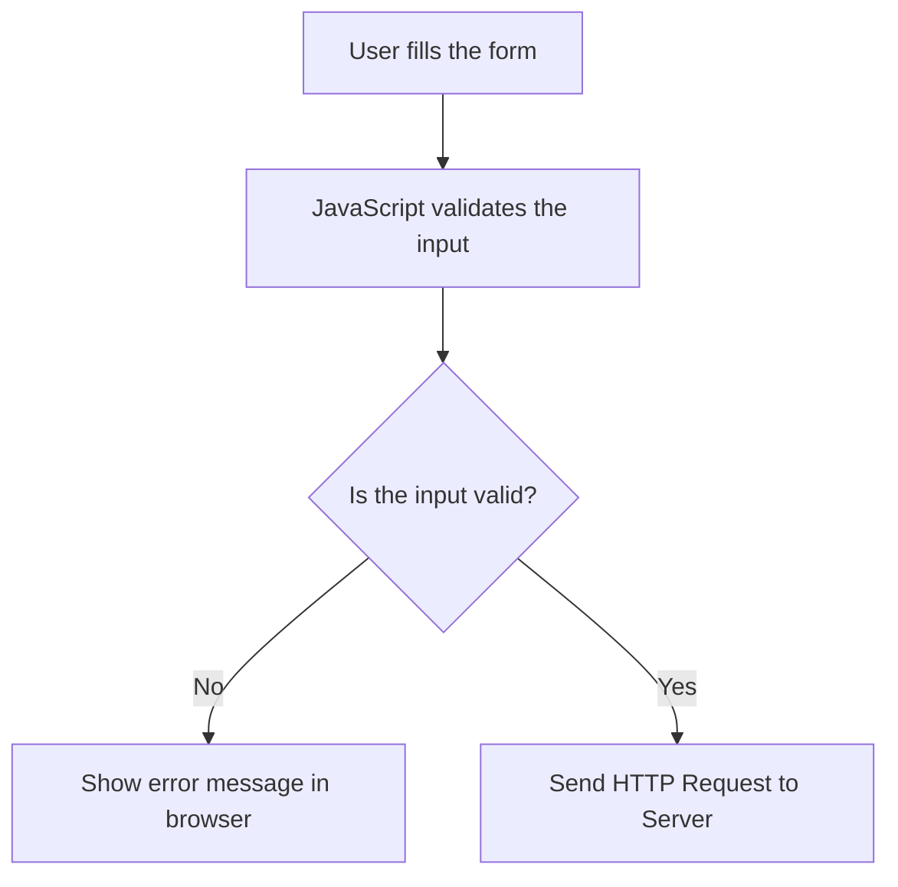

**Advantages:**
- Very fast — no network trip needed
- Reduces unnecessary server load
- Better user experience

> ⚠️ **Important:** Client-side validation can be **bypassed** by a hacker using browser developer tools. So it is never enough on its own.

---

### Server-side Validation

Validation that runs on the **server** after the HTTP request arrives. This is the real and mandatory layer of protection.

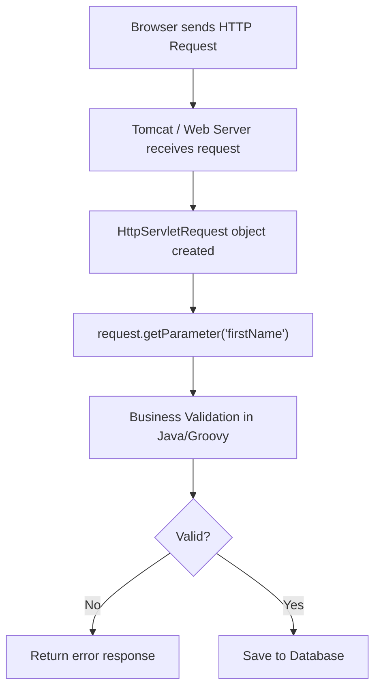

**Example:**
```java
String firstName = request.getParameter("firstName");
if (firstName == null || firstName.isEmpty()) {
    return "error"; // reject the request
}
```

**What server-side validation checks:**
- Required fields that must not be empty
- Duplicate records (e.g., email already exists)
- Business rules (e.g., order quantity must be > 0)
- Database constraints (e.g., foreign key checks)

---

## 2. Seed Data vs Demo Data

### Seed Data

Seed Data is the **minimum required data** for the application to start and run correctly. Without it, OFBiz cannot function.

**Examples of Seed Data:**
- Status IDs (e.g., `ORDER_CREATED`, `ITEM_APPROVED`)
- Enumeration values (e.g., order types, payment types)
- Security groups and permissions
- User login types
- Entity type definitions
- Country and state lists

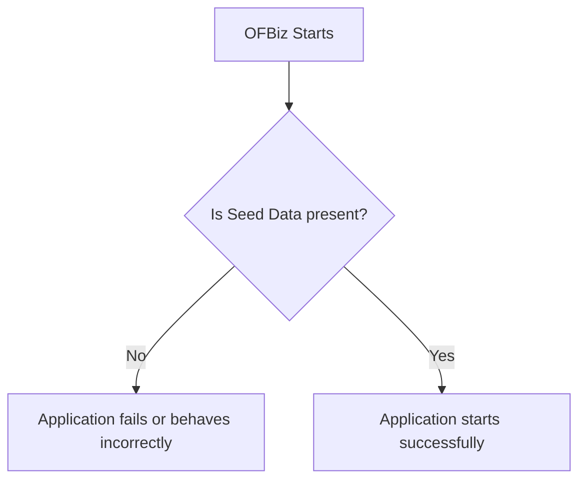

**Where is it stored?**
Inside `data/` folders of each component, in XML files tagged as `seed` or `seed-initial`.

---

### Demo Data

Demo Data is **optional** data used only for testing, learning, or demonstrations. Removing it does not break the application.

**Examples of Demo Data:**
- Demo customers (e.g., `DemoCustomer`)
- Demo orders
- Demo products

> ✅ In production environments, demo data is **not loaded**.

---

## 3. Logging in OFBiz

OFBiz uses **Apache Log4j2** for logging instead of `System.out.println()`.

### Why not use `System.out.println()`?

| Feature | `System.out.println()` | `Debug` class (Log4j2) |
|---|---|---|
| Can be turned ON/OFF | ❌ No | ✅ Yes |
| Writes to log files | ❌ No | ✅ Yes |
| Has severity levels | ❌ No | ✅ Yes |
| Works in production | ❌ Bad practice | ✅ Yes |

### Log Levels (from least to most severe)

```
TRACE  →  Very detailed steps (rarely used)
DEBUG  →  Developer debug info
INFO   →  General information
WARN   →  Something suspicious happened
ERROR  →  Something went wrong
FATAL  →  Critical failure, system may crash
```

### Usage in Java Code

```java
// At top of every OFBiz class:
private static final String MODULE = OrderServices.class.getName();

// In your method:
Debug.logInfo("Order created successfully! OrderId: " + orderId, MODULE);
Debug.logWarning("Product stock is running low!", MODULE);
Debug.logError("Cannot find Order with ID: " + orderId, MODULE);
Debug.logError(e, "Exception occurred while processing order", MODULE);
Debug.logFatal("Database connection lost!", MODULE);
```

> The `MODULE` constant tells Log4j **which class** wrote the message. This makes it easy to find problems in the logs.

### Log Output Format

```
2026-07-14 10:30:15 | main-thread          | OrderServices            |I| Order created: ORD1001
```

| Part | Meaning |
|---|---|
| `2026-07-14 10:30:15` | Date and time |
| `main-thread` | Which thread ran the code |
| `OrderServices` | Which class logged the message |
| `I` | Level: I=Info, W=Warn, E=Error, F=Fatal |
| `Order created: ORD1001` | The actual message |

### Log Files

| File | What it contains |
|---|---|
| `runtime/logs/ofbiz.log` | ALL messages (info, warn, error...) |
| `runtime/logs/error.log` | ONLY error and fatal messages |

> Log files automatically **rotate** when they reach 10 MB. Old files are renamed (`ofbiz.log.1`, `ofbiz.log.2`...).

---

## 4. debug.properties

This file is located at `framework/base/config/debug.properties`. It controls **which log levels are active**.

```properties
print.verbose=false      # Too much detail — keep OFF in most cases
print.timing=true        # Shows how long operations take
print.info=true          # General info messages
print.important=true     # Important notices
print.warning=true       # Warnings
print.error=true         # Errors
print.fatal=true         # Fatal crashes
```

> **Tip:** In a production server, set `print.verbose=false` and `print.timing=false` to reduce log noise and improve performance.

---

## 5. Service Pattern in OFBiz

Every service in OFBiz follows the **same pattern**: takes a `Map` as input, returns a `Map` as output.

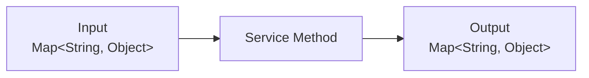

### Service Method Signature

```java
public static Map<String, Object> createCustomer(
        DispatchContext dctx,
        Map<String, Object> context) {

    // Get delegator and dispatcher
    Delegator delegator = dctx.getDelegator();
    LocalDispatcher dispatcher = dctx.getDispatcher();

    // Read inputs from context map
    String firstName = (String) context.get("firstName");
    String lastName  = (String) context.get("lastName");

    // Do business logic here...

    // Return success
    return ServiceUtil.returnSuccess();
    // Or return error:
    // return ServiceUtil.returnError("Something went wrong!");
}
```

### What a Service Usually Contains

- **Input reading** — `context.get("fieldName")`
- **Validation** — checking if inputs are correct
- **Business logic** — calculations, decisions
- **Database operations** — using `delegator`
- **Calling other services** — using `dispatcher.runSync()`
- **Error handling** — try/catch blocks
- **Logging** — `Debug.logInfo(...)`, `Debug.logError(...)`
- **Return result** — `ServiceUtil.returnSuccess()` or `ServiceUtil.returnError()`

---

## 6. Event

An Event is a Java method that acts as the **bridge between the UI (browser) and a Service**.

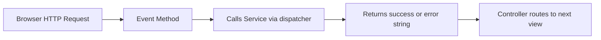

**Key characteristics:**
- Has access to `HttpServletRequest` and `HttpServletResponse`
- Can read session data (who is logged in)
- Performs **input validation** before calling a service
- Returns a string like `"success"` or `"error"` — the controller uses this to decide which page to show next

```java
public static String createCustomerEvent(
        HttpServletRequest request,
        HttpServletResponse response) {

    String firstName = request.getParameter("firstName");

    // Validate
    if (firstName == null || firstName.isEmpty()) {
        request.setAttribute("_ERROR_MESSAGE_", "First name is required");
        return "error";
    }

    // Call service
    // ...
    return "success";
}
```

> **Remember:** Events know about HTTP and sessions. Services do NOT. This separation keeps business logic clean and reusable.

---

## 7. Component Loading

OFBiz loads components in a specific order every time it starts.

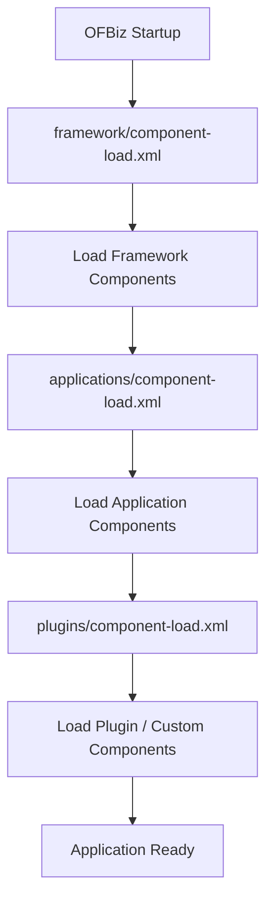

Each component is defined by an `ofbiz-component.xml` file that tells OFBiz:
- Where entity definitions are
- Where service definitions are
- Where data files are
- Where the webapp is
- What URL path (mount point) to use

---

## 8. Component Structure

```
plugins/myPlugin/
│
├── config/                  ← UI Labels and .properties files
├── data/                    ← Seed and Demo XML data files
├── dtd/                     ← XML schema definitions
├── entitydef/               ← Entity (table) definitions
│   └── entitymodel.xml
├── servicedef/              ← Service definitions
│   └── services.xml
├── src/                     ← Java and Groovy source code
│   └── main/groovy/...
├── widget/                  ← Screen and Form widgets (XML UI)
│   ├── screens/
│   └── forms/
├── webapp/                  ← Web application files
│   ├── WEB-INF/
│   │   ├── web.xml
│   │   └── controller.xml
│   ├── *.ftl               ← FreeMarker HTML templates
│   ├── *.js
│   └── *.css
└── ofbiz-component.xml      ← Component registration file
```

---

## 9. Config Folder

### `ExampleUiLabels.xml` — Multilingual Labels

This file stores all text labels used in the UI, in multiple languages.

**Why is this important?**
- OFBiz supports **Internationalization (i18n)** — the app can display in any language
- **Localization (l10n)** — adapting content for a specific region

```xml
<property key="OrderCreated">
    <value xml:lang="en">Order Created</value>
    <value xml:lang="es">Pedido Creado</value>
    <value xml:lang="fr">Commande Créée</value>
</property>
```

In a FTL template, you use it as:
```
${uiLabelMap.OrderCreated}
```
OFBiz automatically shows the label in the user's language.

---

### `.properties` Files

Store simple `key = value` configuration pairs.

```properties
application.name=My OFBiz App
max.order.limit=1000
default.currency=USD
```

The general properties file is at:
```
framework/common/config/general.properties
```

Read in Java using:
```java
String value = UtilProperties.getPropertyValue("general", "application.name");
```

---

## 10. Data Folder

The `data/` folder inside each component contains XML files that are loaded into the database.

Which files get loaded is controlled by `ofbiz-component.xml`:
```xml
<entity-resource type="data" reader-name="seed"
    location="data/MySeedData.xml"/>
<entity-resource type="data" reader-name="demo"
    location="data/MyDemoData.xml"/>
```

| `reader-name` | Loaded by command |
|---|---|
| `seed` | `./gradlew loadAll` |
| `seed-initial` | `./gradlew loadAll` (only first time) |
| `demo` | `./gradlew loadAll` |
| `ext` | `./gradlew loadAll` |

---

## 11. Entity Definition

Entity definitions are stored in `entitydef/entitymodel.xml`. They define the **database tables** in OFBiz's own XML language — you never write raw SQL for table creation.

```xml
<entity entity-name="Customer"
        package-name="com.example.myapp"
        title="Customer Entity">

    <field name="customerId"    type="id"/>
    <field name="firstName"     type="name"/>
    <field name="lastName"      type="name"/>
    <field name="emailAddress"  type="email"/>
    <field name="createdDate"   type="date-time"/>

    <prim-key field="customerId"/>

    <relation type="one" rel-entity-name="Party">
        <key-map field-name="customerId" rel-field-name="partyId"/>
    </relation>
</entity>
```

OFBiz reads this XML and automatically:
1. Creates the table in the database if it doesn't exist
2. Generates the SQL `CREATE TABLE` statement
3. Manages all CRUD operations through the Delegator

---

## 12. Field Types

When you define a field in an entity, you use a **type name** (not a raw database type). OFBiz maps these type names to actual database column types.

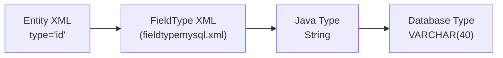

**Common field types:**

| Type Name | Java Type | MySQL Type |
|---|---|---|
| `id` | String | VARCHAR(40) |
| `id-long` | String | VARCHAR(100) |
| `name` | String | VARCHAR(100) |
| `description` | String | VARCHAR(255) |
| `very-long` | String | LONGTEXT |
| `date-time` | Timestamp | DATETIME |
| `date` | Date | DATE |
| `currency-amount` | BigDecimal | DECIMAL(18,2) |
| `numeric` | Long | BIGINT |
| `indicator` | String | CHAR(1) — stores 'Y' or 'N' |

Field type mappings are stored in:
```
framework/entity/fieldtype/fieldtypemysql.xml
framework/entity/fieldtype/fieldtypederby.xml
```

---

## 13. Services Definition

Services are **declared** in `servicedef/services.xml` before being **implemented** in Java or Groovy.

```xml
<service name="createCustomer" engine="java"
         location="com.example.myapp.CustomerServices"
         invoke="createCustomer"
         auth="true"
         transaction-timeout="30">

    <description>Creates a new customer record</description>

    <auto-attributes include="nonpk" mode="IN" optional="true"/>

    <attribute name="customerId"  mode="OUT" type="String" optional="false"/>

</service>
```

**Key attributes explained:**

| Attribute | Meaning |
|---|---|
| `engine="java"` | The service is written in Java (can also be `groovy`, `script`) |
| `auth="true"` | User must be logged in to call this service |
| `transaction-timeout="30"` | DB transaction times out after 30 seconds |
| `auto-attributes include="nonpk"` | Automatically add all non-primary-key entity fields as inputs |
| `mode="IN"` | Input parameter |
| `mode="OUT"` | Output parameter |
| `optional="true"` | This field is not required |

---

## 14. Source Folder

The `src/` folder contains the actual business logic in **Java** or **Groovy**.

```
src/
└── main/
    ├── java/
    │   └── com/example/myapp/
    │       └── CustomerServices.java
    └── groovy/
        └── com/example/myapp/
            └── CustomerLogic.groovy
```

**When to use Java vs Groovy:**
- **Java** — for complex services, performance-critical code, when type safety matters
- **Groovy** — for scripts in screen widgets, quick logic, closures, and simpler services

---

## 15. Web Layer

```
webapp/
│
├── WEB-INF/
│   ├── web.xml          ← Servlet configuration (entry point)
│   └── controller.xml   ← URL routing (request-maps, view-maps)
│
├── *.ftl                ← FreeMarker HTML templates
├── *.js                 ← JavaScript files
└── *.css                ← CSS stylesheets
```

**`web.xml`** — tells Tomcat:
- Which Servlet handles all requests (it's `ControlServlet`)
- What the app's base URL path is (e.g., `/example`)

**`controller.xml`** — tells OFBiz:
- Which URL maps to which Event
- Which Event result maps to which View
- Which View maps to which Screen

---

## 16. Request Flow

This is how a request travels from browser to response in OFBiz:

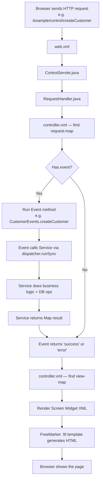

**Key files to study:**
- `framework/webtools/src/.../control/ControlServlet.java`
- `framework/webtools/src/.../control/RequestHandler.java`

---

## 17. Login Flow

When a user logs in to OFBiz, this is what happens:

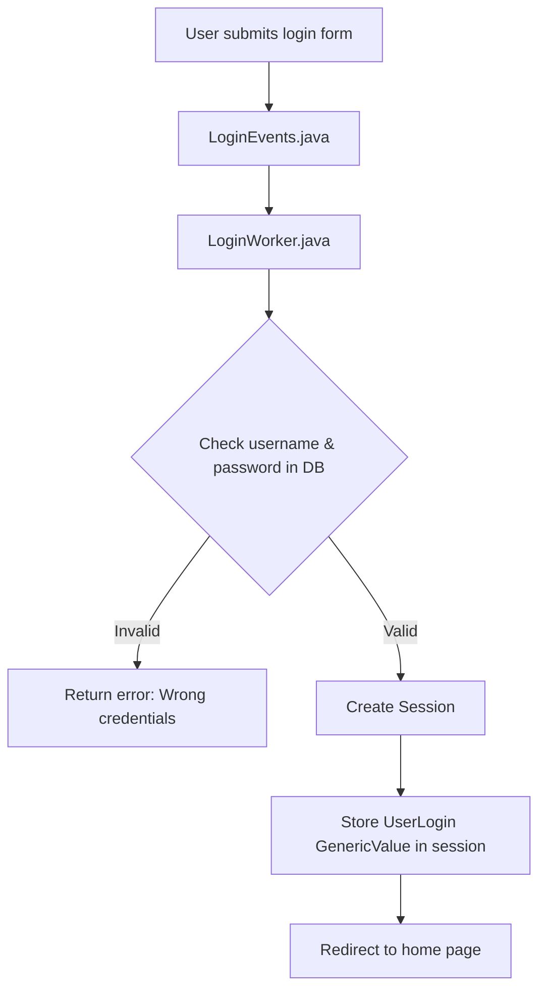

- **`LoginEvents.java`** — handles the HTTP request and calls LoginWorker
- **`LoginWorker.java`** — contains the actual authentication logic
- **Session** — server-side memory that remembers who you are during your visit

---

## 18. Screen Widget

Screen Widgets define **page layouts** using XML. They are OFBiz's own UI templating system.

### Structure of a Screen

```xml
<screen name="CustomerDetail">
    <section>
        <actions>
            <!-- Step 1: Prepare data for the page -->
            <set field="titleProperty" value="Customer Detail"/>
            <entity-one entity-name="Customer" value-field="customer">
                <field-map field-name="customerId" from-field="parameters.customerId"/>
            </entity-one>
        </actions>
        <widgets>
            <!-- Step 2: Render the UI -->
            <decorator-screen name="main-decorator"
                location="component://example/widget/screens/CommonScreens.xml">
                <decorator-section name="body">
                    <include-form name="CustomerDetailForm"
                        location="component://example/widget/forms/CustomerForms.xml"/>
                </decorator-section>
            </decorator-screen>
        </widgets>
    </section>
</screen>
```

### Simple Data Preparation (`<set>`)

Used when you need to assign a simple value:
```xml
<set field="customerName" value="Amogh"/>
<set field="pageTitle" value="Order Management"/>
```

### Complex Data Preparation (Groovy Script)

Used when you need loops, conditions, or API calls:
```xml
<script location="component://example/groovy/PrepareCustomerData.groovy"/>
```

---

## 19. Include Screen

Used to embed one screen inside another:
```xml
<include-screen name="CustomerHeader"
    location="component://example/widget/screens/CustomerScreens.xml"/>
```
This is like including a header/footer component — reusable across multiple pages.

---

## 20. Context Map & Parameters Map

### Context Map

The `context` is an **implicit object** available in all screens and FTL templates. You do NOT need to declare it.

In a Groovy script:
```groovy
context.customerName = "Amogh"    // Set a value
```

In a FTL template:
```
${customerName}    ← Access directly, no need for context.get()
```

### Parameters Map

The `parameters` map contains all HTTP request parameters. OFBiz automatically fills it from `HttpServletRequest`.

In a FTL template:
```
${parameters.customerId}    ← Same as request.getParameter("customerId")
```

In a Groovy/screen action:
```groovy
String customerId = parameters.customerId
```

---

## 21. Context Parameters from `web.xml`

You can define application-level parameters in `web.xml`:
```xml
<context-param>
    <param-name>mainDecoratorLocation</param-name>
    <param-value>component://example/widget/screens/CommonScreens.xml</param-value>
</context-param>
```

Access in screens:
```xml
<decorator-screen name="main-decorator" location="${parameters.mainDecoratorLocation}"/>
```

---

## 22. Main Decorator

The Main Decorator is the **master page template** — it provides the consistent layout that wraps every page.

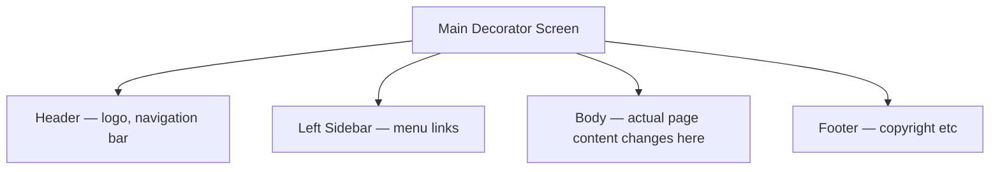

The body content is injected using:
```xml
<decorator-section-include name="body"/>
```

Each page screen defines what goes in the `body` decorator section.

---

## 23. Theme Initialization

OFBiz themes control the look and feel. Initialization order:

```
framework/common/widget/CommonScreens.xml
    └── InitTheme.groovy (runs on every page load)
        └── themes/common-theme/widget/CommonScreens.xml
            └── Applies CSS, JS, layout settings
```

---

## 24. Build Process

### `./gradlew build`
- Compiles all `.java` files into `.class` files
- Packages them into `.jar` files
- Checks for compile errors
- Does NOT start the server

### `./gradlew ofbiz`
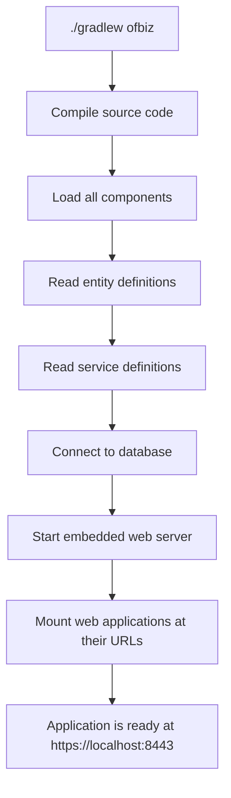

### `./gradlew loadAll`
Loads **all data files** into the database.

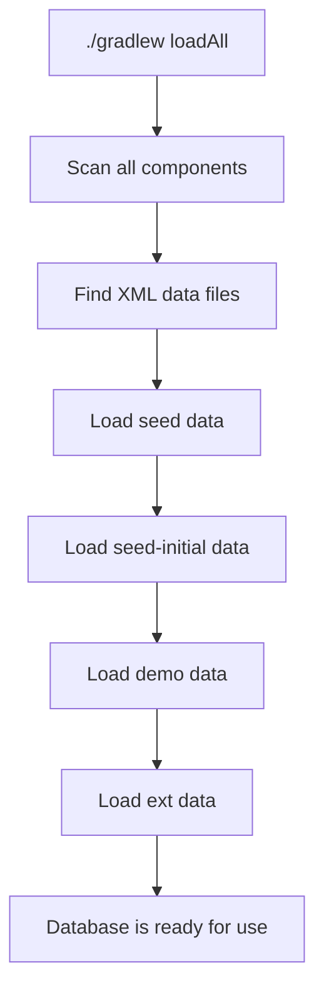

> Run `loadAll` once after setting up a fresh database, or after a full reset.

---

## 25. Database Connectivity

Database connection is configured in `entityengine.xml`:

```xml
<datasource name="localmysql" ...>
    <inline-jdbc
        jdbc-driver="com.mysql.cj.jdbc.Driver"
        jdbc-uri="jdbc:mysql://127.0.0.1/ofbiz"
        jdbc-username="root"
        jdbc-password="12345"
        isolation-level="ReadCommitted"
        pool-minsize="2"
        pool-maxsize="250"/>
</datasource>
```

The JDBC driver JAR is added to the classpath via `dependencies.gradle`.

---

## 26. XML to SQL Flow

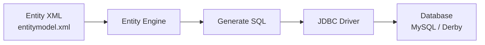

You write XML. OFBiz generates and runs the SQL for you.

---

## 27. Full Navigation Flow Example

```
https://localhost:8443/example/control/main

↓ web.xml → ControlServlet

↓ RequestHandler → controller.xml

↓ request-map name="main"

↓ event (optional)

↓ service (optional)

↓ view-map name="main"

↓ ExampleScreens.xml → screen "main"

↓ CommonScreens.xml → main-decorator

↓ Theme CSS/JS applied

↓ HTML sent to browser
```

---

## Recommended Study Order

Study topics in this order — it follows how a request flows through the system:

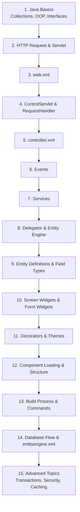

---

## Quick Reference Cheat Sheet

| Concept | One-liner |
|---|---|
| **Client-side Validation** | Runs in browser before request is sent |
| **Server-side Validation** | Runs on server — mandatory and cannot be bypassed |
| **Seed Data** | Minimum data needed for the app to run |
| **Demo Data** | Optional data for testing only |
| **Debug class** | OFBiz logging — replaces `System.out.println()` |
| **debug.properties** | Turns log levels ON/OFF |
| **Service** | Stateless business logic — `Map` in, `Map` out |
| **Event** | HTTP-aware bridge between UI and Service |
| **Delegator** | Manager between your code and the database |
| **GenericValue** | One database row (works like a Map) |
| **ofbiz-component.xml** | Component registration file |
| **entitymodel.xml** | Defines database tables in XML |
| **services.xml** | Declares services (name, engine, params) |
| **controller.xml** | Maps URLs to Events and Views |
| **web.xml** | Servlet configuration and mount point |
| **Screen Widget** | XML-based page layout |
| **Form Widget** | XML-based form or list |
| **Context Map** | Implicit data map available in screens/FTL |
| **Parameters Map** | HTTP request parameters — filled automatically |
| **Main Decorator** | Master page template (header + body + footer) |
| **`./gradlew build`** | Compile source code into JAR files |
| **`./gradlew ofbiz`** | Start the OFBiz web server |
| **`./gradlew loadAll`** | Load all seed/demo data into the database |
| **`runtime/logs/`** | Where `ofbiz.log` and `error.log` are written |
